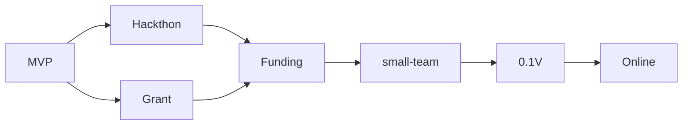

# Meeting notes

## joined
+ Ant Nicolas

## Question list
1. How to affect the game of settings?
World settings, Lord settings, the climate, the limitation
and how about the probability judging and assert? E.g. lucy?
Ant says it will be config files, to be traced.

2. Token will support all chain
no hurry

3. Providing the 3-days Text Metaverse establishment service pack?
any problems? talk about it.
I finish a craft graph

```mermaid
flowchart LR
   DAOs --> Google-Apply-Form --> Check the Form --> Gnerate JSON --> Run script --> (Generate Docker) --> Design the story --> Distribution run Docker(3 at least) --> (Load game test) --> Open for Community

```

4. This weeks MVP?
What can I do for this target?

5. Multi language support?
In game we offer English default? and community can translate into their own language?
big job

6. Hacker's attack?
no hurry

7. Sequence of operation

[测试网上推出功能齐全的产品后 1 万美元,Harmony](https://open.harmony.one/300m-on-bounties-grants-daos/apply-for-grants-or-dao)
[Solana]()
[Gitcoin]()
[Plancker]()
[Off line]()

8. learn from galaxy 
galaxy project
no hurry

9. user acquisition
Email and password to build their NFT(normal level) on harmony(we pay the gas).
NFT published on Opensea or China mainland market, can mint into game with rarity attributes.
All NFT holders are the game's owner(share holders), we are the maintainer, we the DAO.
Twitter seed plan: spread the reg link from you, if they mint NFT, 1/10 power belongs to you.
Fiat entrance ?

## Todo and arrange
## Nicolas
1. Tokenomics go on
2. Grant and progress
3. Protocol and contract design(flow chart)
4. docs works