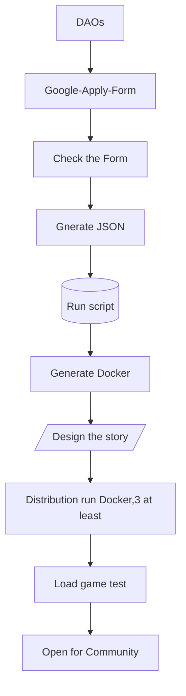

# Welcome to Textverse
+ Textverse is a Text Metaverse(Game) Engine for Web3.
+ Build by Community, for Community. We build Public Goods.
+ WE ARE THE FULL TIME WEB3 BUILDER, NOT OTHERS.
+ 

## Overview
+ We are Textverse, build **Web3 Infrastructure**, A Text Metaverse Engine Category Primitives.
+ We build Public Goods for Web3 with **Interoperability and Composability**.
+ Textverse has **three parts**: 
+ **Open NFT Transfer Protocol** with series of Smart contract, maintained by the **Protocol DAO**.
+ **Text Metaverse(Game) Engine** with Web3 TID for any communities, free to use, maintained by the real company.
+ **DAO2DAO service mode**(D2D,we create this first？) with ReGenEconomics is our long time service.

### Value for Web3
+ Textverse is **Public goods** for Community.
+ Providing to plain users to join and play in **a very Easy Mode**: just **Typing on any screen**.
+ Mint NFTs to help players to **own their value and assets** in Web3.
+ Build relations with the DAOs by **Tokens Exchange Stake**, they are **all the stake-holders of us**.
+ Textverse can **help any communities,DAOs** extend their story within a Text Metaverse.
+ Also, we build a series of tools and smart contracts to **solve the engineering problems**.
+ So the communities can **focus on** the Creative and Imaginations on their Metaverse. 

## Mission
+ Literal is the basic and essence of the Human Civilization.
+ We have Colorful world, good music, and pretty or handsome Stars.
+ But we must trust, the Power of Text is Strong.
+ So our mission is **Simple Text Records Power Imaginations**.

### What are Interoperability and Composability?
+ NFT is great but we can only show by PFP avatar, and nothing else can do.
+ We define the **Interoperability**:
+ **Engineering Problems**: we build protocols and contracts and infrastructures to run it.
+ **Economic Alignment**: we build basic circulating Tokens, offer 80% belonging to Community Token Economics.
+ **Making it Fun**: Yes! The most Creative guys are You, the plains. We offer the blocks, you finish the LEGO.
+ We define the **Composability**:
+ **Compound**: More and More, Connected Metaverse with code,interfaces, systems and tokens.
+ **Mods**: Plugin and Plugout in anywhere. Build with technical and financial and funny stories.
+ **Cross Area**: Walk through the Metaverse with Composable DID and TID can make you be Individual.
+ **Creator = Player = Beneficiary**: Create and Earn, Play and Earn, we are stake-holder.

### Problems with current 
+ As you know, we have many many Pixels and JPGs or 3Ds NFTs on the market.
+ We call the NFT the entrance of the Metaverse. It will be multi Metaverse in the future.
+ But no one gives a rule or protocol to connect the isolated NFTs and Metaverses.
+ So we must build individual programs for different. 
+ And it will produce Value Isolation with different rules.
+ Just like I have 500$ and saved in different banks, if you want to operate it, transfer or gather the assets, you can’t. 
+ Cause different banks have a variety of complex principles to save and withdraw.

### Textverse Solution
+ We have a basic idea called NFT Interoperability **Standard**.
+ It can give abilities to NFT holders to INTERACTION with their NFTs, the strength of Interoperation. 
+ Like a Magic Transport, the **Standard** protocol can **bridge** the banks with simplicity and transparency and is open-source. 
+ Make your NFT assets can be **transferred** into and out of all Metaverse with infinite **liquidity**, we supply a handle convenience interface called ERC7211.
+ Also empower the teams who create NFTs to make the monkeys or girlfriends on paper or Opensea page be alive in different Metaverse or same Metaverse.
+ Yes, Transport your NFT to Metaverse with ONE **Standard** protocol and Play with it!
+ Basic progress:

### Protocol 7211
+ **Metaverse Registry**
+ We may have many Metaverse, so we must have a **Metaverse list registry**.
+ We define the basic meta data of Metaverse, special for Text Metaverse.
+ **Transfer**
+ If you have any PFP NFTs, you can **Transfer** into Any (Text) Metaverses.
+ Now you can make your NFT assets be Interoperated by your will.
+ **Transport**
+ After playing in the Jurassic park, you can **Transport** to the Ocean World in seconds.
+ Just type the screen and switch channel like TV.
+ **Flow**
+ 

### TID
+ It was a ERC1155 NFT, free to mint and stake to earn.
+ We will mint Crypto Tokens to record who support us, the **Early Bird**.
+ So The Text Metaverse Registry will give you a **TID** record on the chain and backup in IPFS and Arweave.
+ It can involve all your assets in the Metaverse with Hash link.
+ Maybe in 20 years later, the DIGI DID(TID) will be your most of your life: work, credit, friends, community and fun.

## Join Textverse Community
+ Welcome to everyone to join, free to play.
+ [Discord](https://discord.com/invite/Qj9ChuSdAt)
+ [Twitter](https://twitter.com/TextverseApp)
+ Business Cooperation: jhfnetboy#gmail.com
+ [DAOs see here](DAOs-build-your-Metaverse.md)
+ [Players see here](How-to-play.md)
+ [Our github](https://github.com/twinsant/ethos).
+ [Docs](https://dao-sx.github.io/ethos/)
+ It was merged from two projects of the two genesis member:[jhfnetboy](https://github.com/jhfnetboy), and [twinsant](https://github.com/twinsant).
