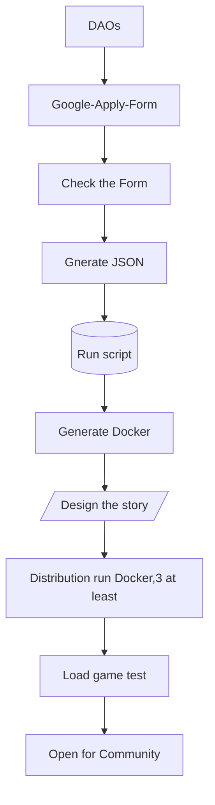
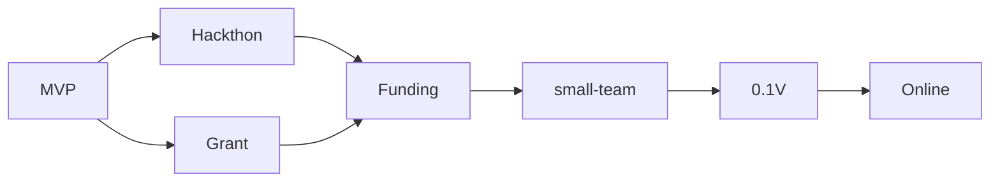

# 4-22 Meeting notes

## joined
+ Ant, Nicolas

## Question list
1. How to affect the game of settings?
+ World settings, Lord settings, the climate, the limitation
+ and how about the probability judging and assert? E.g. lucy?
+ Ant says it will be config files, to be traced.

2. Token will support all chain
+ Not the urgent

3. Providing the 3-days Text Metaverse establishment service pack?
any problems? talk about it.
+ I finish a craft graph


```
form to json
https://github.com/stevenschmatz/export-google-form
```

4. This weeks MVP?
+ What can I do for this target?
+ Go on the Funding\Tokenomics\Product test\Contract design.

5. Multi language support?
In game we offer English default? and community can translate into their own language?
+ Big problem, todo

6. Hacker's attack?
Not the most urgent

7. Sequence of operation

+ [测试网上推出功能齐全的产品后 1 万美元,Harmony](https://open.harmony.one/300m-on-bounties-grants-daos/apply-for-grants-or-dao)
+ [Solana]()
+ [Gitcoin]()
+ [Plancker]()
+ [Off line]()

8. learn from galaxy 
+ galaxy project docs
+ Not the most urgent

9. user acquisition
+ Email and password to build their NFT(normal level) on harmony(we pay the gas).
+ NFT published on Opensea or China mainland market, can mint into game with rarity attributes.
+ All NFT holders are the game's owner(share holders), we are the maintainer, we the DAO.
+ Twitter seed plan: spread the reg link from you, if they mint NFT, 1/10 power belongs to you.
+ Fiat entrance ?

## Todo and arrange
## Nicolas
0. all docs in ethos doc directory
1. view in here: https://dao-sx.github.io/TVdocs/
2. Tokenomics go on
   + four parts
3. Grant and progress
   + finish one
   + do the harmony and gitcoint
4. Protocol and contract design(flow chart)
   + craft
5. docs works
   gh-pages


# 4-25? meeting notes