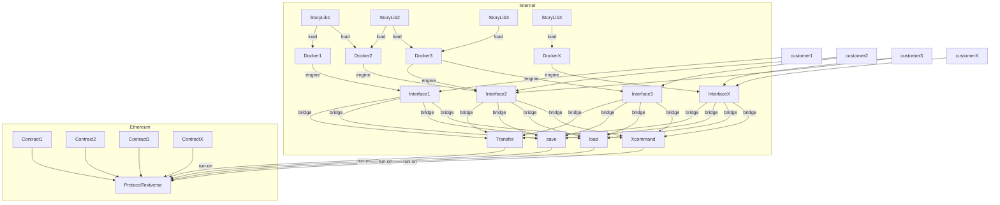

# Architecture Analysis

## Deploy Components
+ We have four parts to deploy.
+ 1.Dockers
+ 2.Stories
+ 3.Contracts
+ 4.Interfaces

### Docker image
+ It contains of the Core Interaction Engine and Bridge.
+ E.g. : look, fight, pick, give...
+ It will transfer from centralized to decentralized.

### Lib (Story)
+ It was the customer define and running story, mostly run by Community.
+ We will provide a KBS landing Metaverse to testify.
+ Open for DAOs.

### Protocol and Contracts
+ The EIP protocol craft is in building status: [draft 7211](https://github.com/jhfnetboy/EIPs/blob/master/EIPS/eip-7211.md).
+ And we build many contracts to provide the core ability: Transfer, Edit, Save, Load, Synthesize, Transform, Quit.
+ Also it will burn the liquidity Token to mint your new NFT of your DATA and Assets.

### Interface
+ We will build the basic interface for Web page, Mobile App and Kinect gears or voice interactions.
+ Yes, we need developers! Create funny and interesting Metaverse.
+ All the code repo is open source for Community.

