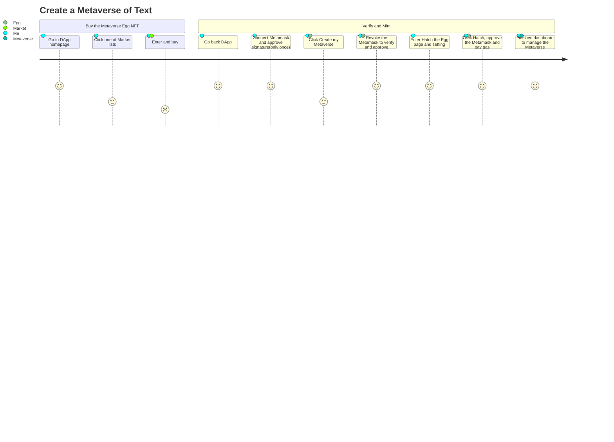
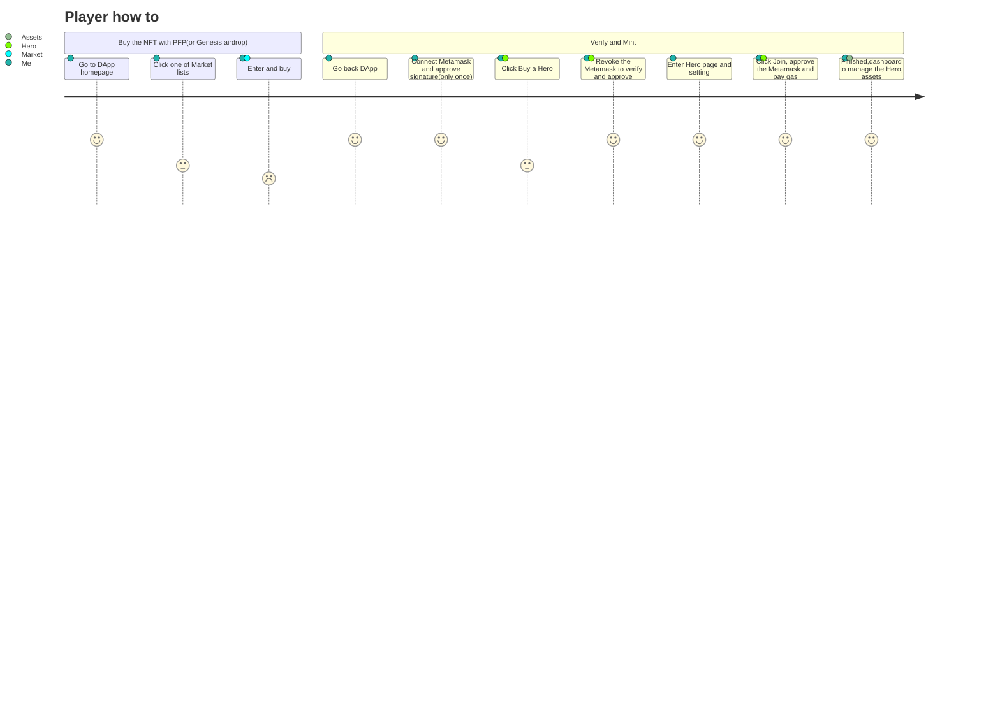
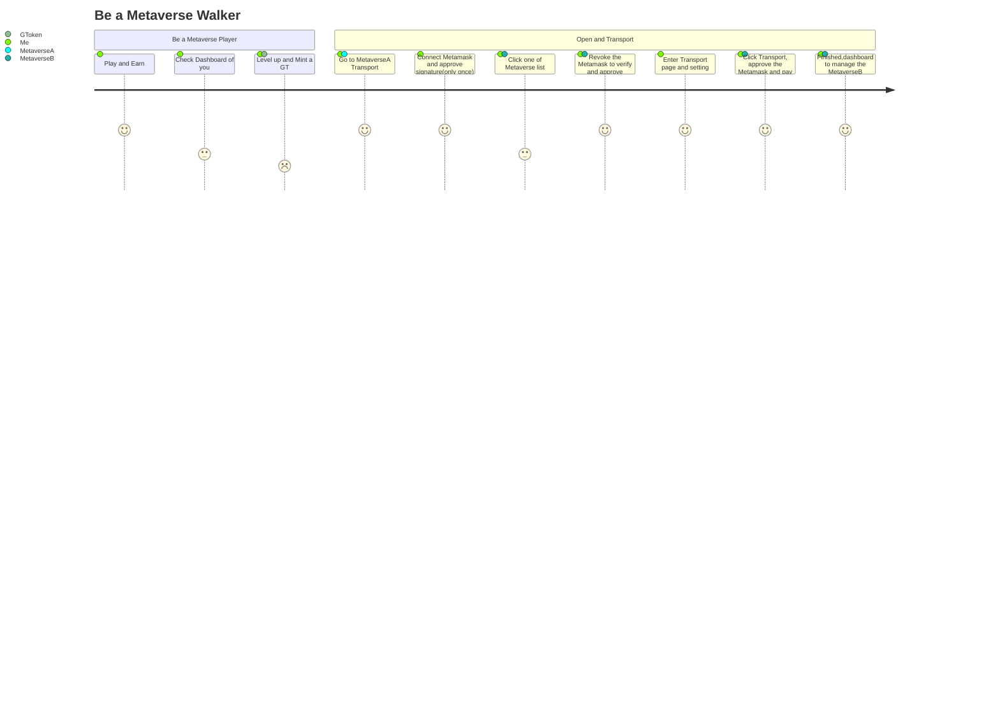
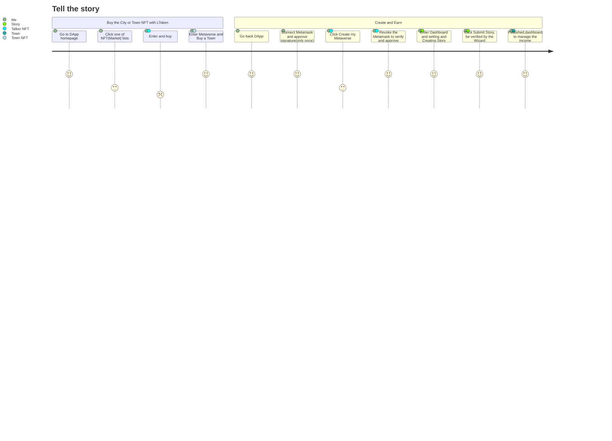
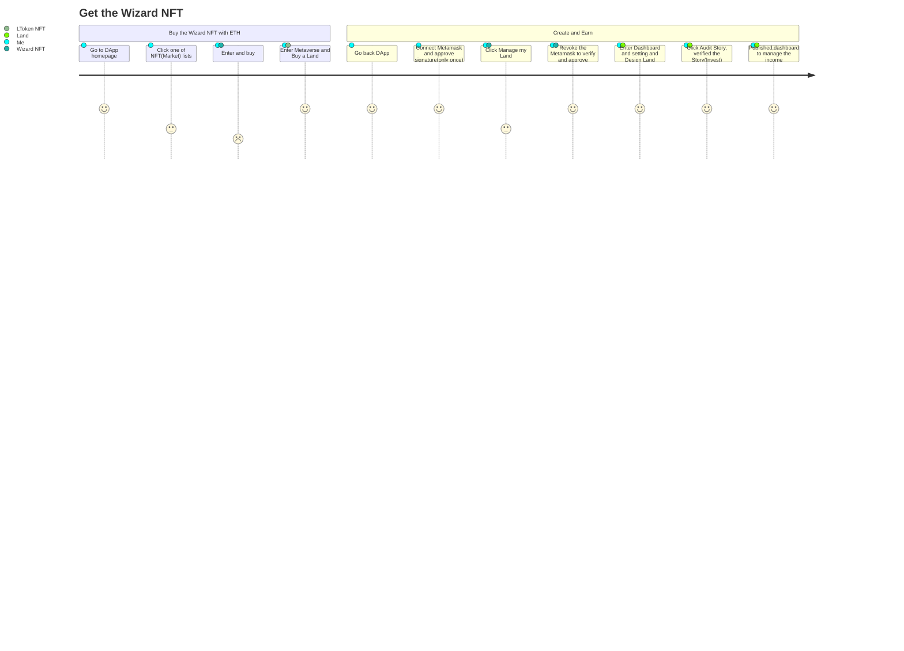

# User journey
+ It the Product docs entrance.
+ For developers.

## Roles
+ Creator, who want to create a Metaverse of Text.
+ Player, who want to join and play the Metaverse.
+ Talker, who want to join and describe the story.
+ Wizard, who was designer of the Metaverse mechanism.

## DApp
+ The DApp named Textverse.app, it will be a Web page based text interaction game.
+ It will provide procedures to finish the different role's action.
+ Firstly will only online web page.
+ Secondly will push the mobile app to the app market.

## Main journey
### Creator

### Player

### Metaverse Walker

### Story Talker

### Wizard

Plain Player
Long time to dev personal ability
Metaverse Walker
Depend on the Equipment and Weapons
Story Talker
Get power from the story and land after invest
Wizard
Must buy Magic books to level up, leave land down level 2
