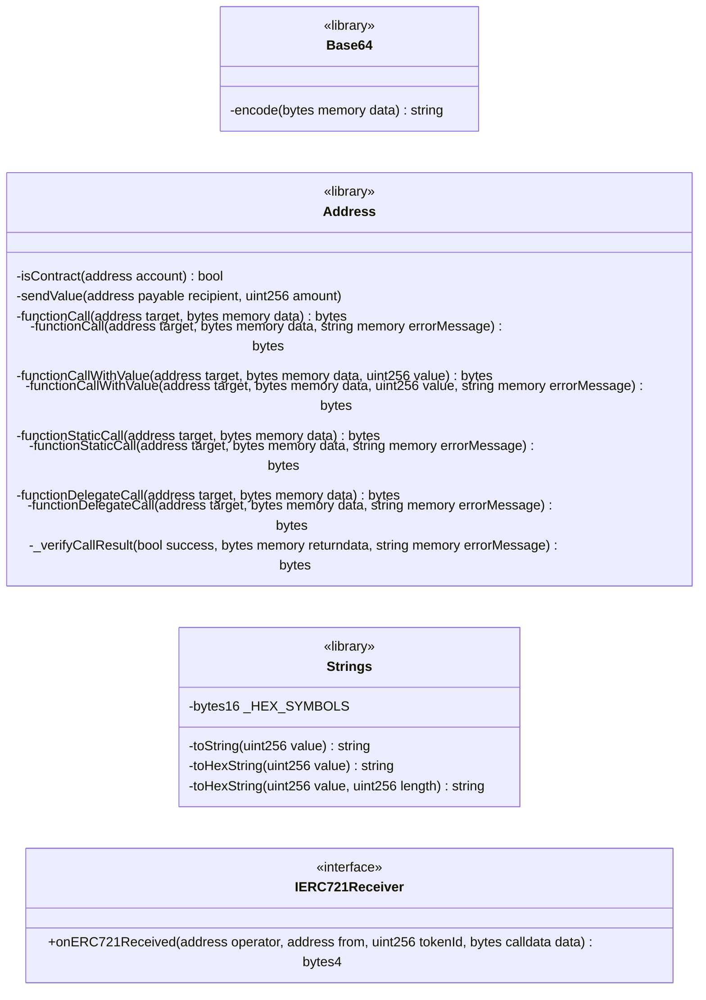

```mermaid
classDiagram
direction RL
    class Base64 {
        <<library>>
        -encode(bytes memory data) string
    }
    class Address {
        <<library>>
        -isContract(address account) bool
        -sendValue(address payable recipient, uint256 amount)
        -functionCall(address target, bytes memory data) bytes
        -functionCall(address target, bytes memory data, string memory errorMessage) bytes
        -functionCallWithValue(address target, bytes memory data, uint256 value) bytes
        -functionCallWithValue( address target, bytes memory data, uint256 value, string memory errorMessage) bytes
        -functionStaticCall(address target, bytes memory data) bytes
        -functionStaticCall(address target, bytes memory data, string memory errorMessage) bytes
        -functionDelegateCall(address target, bytes memory data) bytes
        -functionDelegateCall( address target, bytes memory data, string memory errorMessage) bytes
        -_verifyCallResult(bool success, bytes memory returndata, string memory errorMessage) bytes
    }
    class Strings {
        <<library>>
        -bytes16 _HEX_SYMBOLS
        -toString(uint256 value) string
        -toHexString(uint256 value) string
        -toHexString(uint256 value, uint256 length) string
    }
    class IERC721Receiver {
        <<interface>>
        +onERC721Received( address operator, address from, uint256 tokenId, bytes calldata data) bytes4
    }
```

```mermaid
classDiagram
direction RL
    class IERC165 {
        <<interface>>
        +supportsInterface(bytes4 intefaceId) bool
    }
    IERC721 --> IERC165
    class IERC721 {
        <<interface>>
        +balanceOf(address owner) uint256
        +ownerOf(uint256 tokenId) address
        +safeTransferFrom(address from, address to, uint256 tokenId)
        +transferFrom(address from, address to, uint256 tokenId)
        +approve(address to, uint256 tokenId)
        +getApproved(uint256 tokenId) address
        +setApprovalForAll(address operator, bool _approved)
        +isApprovedForAll(address owner, address operator) bool
        +safeTransferFrom(address from, address to, uint256 tokenId, bytes calldata data)
    }
    class Context {
        <<abstract contract>>
        -_msgSender() address
        -_msgData() bytes
    }
    Ownable --> Context
    class Ownable {
        <<abstract contract>>
        -address  _owner
        +constructor()
        +owner() address
        -modifier onlyOwner() 
        +onlyOwner.renounceOwnership() 
        +onlyOwner.transferOwnership(address newOwner)
        -_setOwner(address newOwner)
    }
    class ReentrancyGuard {
        <<abstract contract>>
        -uint256 _NOT_ENTERED
        -uint256 _ENTERED
        -uint256 _status
        +constructor()
        -modifier nonReentrant()
    }
    IERC721Metadata --> IERC721
    class IERC721Metadata {
        <<interface>>
        +name() string
        +symbol() string
        +tokenURI(uint256 tokenId) string
    }
    ERC165 ..> IERC165
    class ERC165 {
        <<abstract contract>>
    }
    ERC721 --> Context
    ERC721 --> ERC165
    ERC721 ..> IERC721
    ERC721 ..> IERC721Metadata
    class ERC721 {
        -string _name
        -string _symbol
        -mapping _owners
        -mapping _balances
        -mapping _tokenApprovals
        -mapping _operatorApprovals
        +constructor(string memory name_, string memory symbol_)
        -_baseURI() string
        -_safeTransfer(address from, address to, uint256 tokenId, bytes memory _data)
        -_exists(uint256 tokenId) bool
        -_isApprovedOrOwner(address spender, uint256 tokenId) bool
        -_safeMint(address to, uint256 tokenId)
        -_safeMint(address to, uint256 tokenId, bytes memory _data)
        -_mint(address to, uint256 tokenId)
        -_burn(uint256 tokenId)
        -_transfer(address from, address to, uint256 tokenId)
        -_approve(address to, uint256 tokenId)
        -_checkOnERC721Received(address from, address to, uint256 tokenId, bytes memory _data) bool
        -_beforeTokenTransfer(address from, address to, uint256 tokenId) 
    }

    IERC721Enumerable --> IERC721
    class IERC721Enumerable {
        <<interface>>
        +totalSupply() uint256
        +tokenOfOwnerByIndex(address owner, uint256 index) uint256
        +tokenByIndex(uint256 index) uint256
    }

    ERC721Enumerable --> ERC721
    ERC721Enumerable ..> IERC721Enumerable
    class ERC721Enumerable {
        -mapping _ownedTokens
        -mapping _ownedTokensIndex
        -uint256[] _allTokens
        -mapping _allTokensIndex
        -_addTokenToOwnerEnumeration(address to, uint256 tokenId)
        -_addTokenToAllTokensEnumeration(uint256 tokenId)
        -_removeTokenFromOwnerEnumeration(address from, uint256 tokenId)
        -_removeTokenFromAllTokensEnumeration(uint256 tokenId)
    }

    TemporalLoot --> ERC721Enumerable
    TemporalLoot --> ReentrancyGuard
    TemporalLoot --> Ownable
    class TemporalLoot {
        -string[] weapons
        -string[] chestArmor
        -string[] headArmor
        -string[] waistArmor
        -string[] footArmor
        -string[] handArmor
        -string[] necklaces
        -string[] rings
        -string[] suffixes
        -string[] namePrefixes
        -string[] nameSuffixes
        -random(string memory input) uint256
        +getWeapon(uint256 tokenId) string
        +getChest(uint256 tokenId) string
        +getHead(uint256 tokenId) string
        +getWaist(uint256 tokenId) string
        +getFoot(uint256 tokenId) string
        +getHand(uint256 tokenId) string
        +getNeck(uint256 tokenId) string
        +getRing(uint256 tokenId) string
        -pluck(uint256 tokenId, string memory keyPrefix, string[] memory sourceArray) string
        +tokenURI(uint256 tokenId) string

        +nonReentrant.claim(uint256 tokenId)
        -toString(uint256 value) string
        +constructor()
    }
```